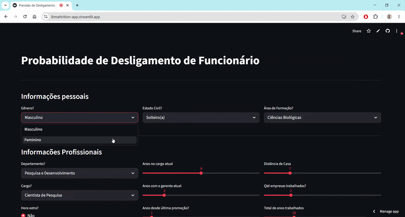

# 🏢 Previsão de Desligamento de Funcionários (Employee Attrition)

[](https://www.python.org/)
[](https://streamlit.io/)
[](https://scikit-learn.org/)

Uma aplicação completa de Machine Learning de ponta a ponta para prever a probabilidade de desligamento (turnover) de funcionários, utilizando dados de Recursos Humanos. O projeto abrange desde a Análise Exploratória de Dados (EDA) até o deploy de uma interface interativa.

[](https://ibmattrition-app.streamlit.app/)

[Clique para testar o App](https://ibmattrition-app.streamlit.app/)


---

## 🎯 Visão Geral do Projeto

O custo de substituição de um funcionário pode ser extremamente alto para as empresas. Este projeto visa identificar proativamente os fatores que levam ao atrito e prever quais funcionários têm maior risco de deixar a companhia, permitindo que a equipe de RH tome decisões baseadas em dados.

**Atenção à Metodologia:** Todo o pipeline de dados, desde a extração até a modelagem final, foi construído **estritamente utilizando Python** (Pandas, Scikit-Learn), sem a utilização de SQL ou ferramentas externas de banco de dados neste escopo.


---

## 📂 Estrutura do Repositório

O repositório está organizado de forma modular para facilitar o entendimento de cada etapa do pipeline:

* **`01_sobre_a_base.md`**: Contextualização do problema de negócio, objetivos do projeto e insights estratégicos extraídos.
* **`02_dicionario_de_dados-ptbr.md`**: Descrição detalhada, tipo de dado e mapeamento de categorias de todas as variáveis disponíveis.
* **`01_gd_attrition_eda.ipynb`**: Análise Exploratória de Dados (EDA), limpeza, análise univariada/bivariada e comportamento das variáveis categóricas e numéricas.
* **`01_gd_attrition_modelos.ipynb`**: Engenharia de atributos e criação de *pipelines* iniciais de pré-processamento (`OneHotEncoding`, `PowerTransformer`).
* **`01_gd_attrition_modelos_rus.ipynb`**: Balanceamento de classes utilizando a técnica de *Random Under Sampling* (RUS) para tratar a assimetria do atrito.
* **`home.py`**: Arquivo principal contendo a interface visual da aplicação construída com Streamlit.

---

## ⚙️ Modelagem e Performance

O modelo final foi construído utilizando **Regressão Logística**, escolhido por sua excelente interpretabilidade e rapidez em cenários de inferência. 

**Técnicas aplicadas no Pipeline:**
* **PowerTransformer:** Utilizado em variáveis numéricas assimétricas (como `RendaMensal`) para forçar uma distribuição normal, otimizando o cálculo dos coeficientes logísticos.
* **MinMaxScaler / StandardScaler:** Padronização de escalas das *features*.
* **Random Under Sampling (RUS):** Tratamento do desbalanceamento da variável alvo, equalizando a proporção de funcionários que saíram e ficaram na empresa durante o treinamento.

---

## 🚀 Como Executar o Projeto Localmente

**1. Clone o repositório**

```bash
git clone https://github.com/djgabriel93/IBM_Attrition.git
cd IBM_Attrition
```

**2. Crie e ative um ambiente virtual (recomendado via Conda):**
```bash
conda create -n machine_learning
conda activate machine_learning
```

**3. Instale as dependências:**
```bash
pip install -r requirements.txt
```

**4. Execute a aplicação web:**
```bash
streamlit run home.py
```

Acesse http://localhost:8501 no seu navegador para interagir com o modelo de previsão.